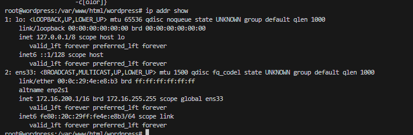
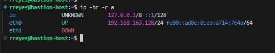

# 2. `ip` - IP Routing and Network Device Configuration

## Overview

The `ip` command is a modern replacement for `ifconfig`, providing more features and capabilities. It is used for managing IP addresses, routes, and network devices in Linux.

<iframe width="720" height="425"
src="https://www.youtube.com/embed/40_HLC0J8DE">
</iframe>

## Common Use Cases
- View and modify IP addresses and routes.
- Manage routing tables.
- Bring network interfaces up and down.

### Command options:
```bash
ip --help
Usage: ip [ OPTIONS ] OBJECT { COMMAND | help }
       ip [ -force ] -batch filename
where  OBJECT := { address | addrlabel | fou | help | ila | ioam | l2tp | link |
                   macsec | maddress | monitor | mptcp | mroute | mrule |
                   neighbor | neighbour | netconf | netns | nexthop | ntable |
                   ntbl | route | rule | sr | tap | tcpmetrics |
                   token | tunnel | tuntap | vrf | xfrm }
       OPTIONS := { -V[ersion] | -s[tatistics] | -d[etails] | -r[esolve] |
                    -h[uman-readable] | -iec | -j[son] | -p[retty] |
                    -f[amily] { inet | inet6 | mpls | bridge | link } |
                    -4 | -6 | -M | -B | -0 |
                    -l[oops] { maximum-addr-flush-attempts } | -br[ief] |
                    -o[neline] | -t[imestamp] | -ts[hort] | -b[atch] [filename] |
                    -rc[vbuf] [size] | -n[etns] name | -N[umeric] | -a[ll] |
                    -c[olor]}
```
### Example Usage:
```bash
ip addr show
```


### Example Usage:
```bash
ip -br -c a
```


#### comand breakdown
- `-br` : Display  brief output
- `-c` : Colorize the output,  will show Down interfaces in red color


## Practice Exercises
1. Display the routing table on your system.
2. Assign a new IP address to a specific interface.

## Additional Resources
- [Video | Deep Dive: The ip Command in Linux](https://www.youtube.com/watch?v=30mQ4fD5kMI&ab_channel=ProwseTech)
- [Practice Lab: Network Configuration with IP](https://linuxjourney.com/lesson/network-interfaces)
