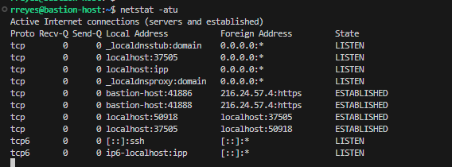
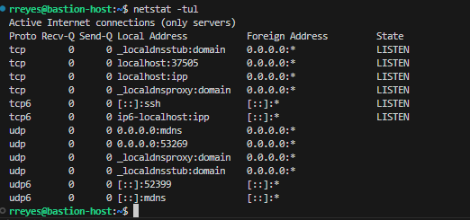
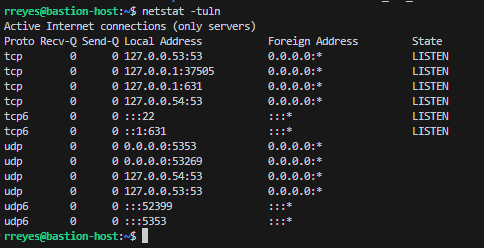
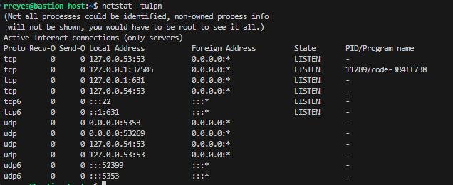

## Overview

`netstat` is used to display network connections, routing tables, and interface statistics. It's useful for monitoring active connections and network health.
<iframe width="720" height="425"
src="https://www.youtube.com/embed/Lcw9bTW06cs">
</iframe>

## Common Use Cases
- Display all active connections.
- View the system's routing table.
- Check listening services and ports.

# Arguments
-a , --all: Display all sockets, not just active ones.
-t , --tcp: Display only TCP sockets.
-u , --udp: Display only UDP sockets.
-n , --numeric: Display only TCP sockets.
-l, --listening: Display listening server sockets.
 -p, --programs: Display PID/Program name for sockets.


There are more options available, but this might be enought by now.

### Example Usage:

```bash
netstat -atu
```


-a: Shows all connections, including those that are listening.
-t: Shows only TCP connections.
-u: Shows only UDP connections.

### Output details:

Proto: Protocol being used, either tcp or udp.
Recv-Q / Send-Q: Number of bytes not yet received (Recv-Q) or sent (Send-Q).
Local Address: Address and port on the local machine. For example, bastion-host:41886 shows a local connection from bastion-host on port 41886.
Foreign Address: Address and port of the remote machine it’s connected to.
State: The connection status, such as LISTEN for waiting connections or ESTABLISHED for active connections.

```bash
netstat -tul
```


-t: Shows only TCP connections.
-u: Shows only UDP connections.
-l: Shows only listening connections.

### Output details:

Focuses on processes waiting for incoming connections, so most State values will be LISTEN for TCP.
Includes UDP services like mdns and other domain-related services.

```bash
netstat -tuln
```


-t: Filters to show only TCP connections.
-u: Filters to show only UDP connections.
-l: Shows only listening connections.
-n: Shows numerical addresses and port numbers instead of trying to resolve them to hostnames and service names

```bash
netstat -tulpn
```


-p: Displays the process ID (PID) and program name responsible for each connection.
-n: Shows addresses and ports in numeric format without resolving to names.
-l: Displays listening server sockets.

### Output details:

PID/Program name: Shows the process ID and program name for each service.
Not all processes could be identified: Some processes are restricted, so without root privileges, you won’t see the details of all programs.

## Practice Exercises
1. List all active connections on your system.
2. Display the routing table and identify any errors.

## Additional Resources
- [Video: Netstat in Practice](https://www.example.com/netstat-tutorial)
- [Practice Lab: Monitoring Network with Netstat](https://www.example.com/netstat-lab)

## Relevance to Nagios
Nagios can use `netstat` to check for open ports and active connections, monitoring services for availability and alerting admins when unexpected connections occur.

# References
- [Netstat command in Linux](https://www.geeksforgeeks.org/netstat-command-linux/)
- [How to Use netstat on Linux](https://www.howtogeek.com/513003/how-to-use-netstat-on-linux/)