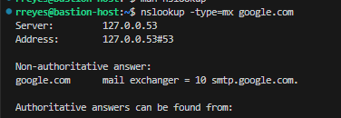

## Overview

The `nslookup` command is used to query DNS servers to resolve domain names to IP addresses. It is a basic DNS troubleshooting tool.


<iframe width="720" height="425"
src="https://www.youtube.com/embed/jf-x76XYY2o&ab">
</iframe>

<iframe width="720" height="425"
src="https://www.youtube.com/embed/CQNRg9dsSsM">
</iframe>


### General Tips for Using nslookup

- **Usage of `type` Argument**: The `-type` argument specifies what kind of DNS record to query for:
  - **`A`**: Finds IPv4 addresses.
  - **`AAAA`**: Finds IPv6 addresses.
  - **`MX`**: Finds mail servers for a domain.
  - **`NS`**: Finds name servers.
  - **`TXT`**: Finds text records, often used for verification (e.g., SPF, DKIM).
  
- **Non-Authoritative vs. Authoritative Answers**:
  - **Non-authoritative**: Results come from a DNS cache, not directly from the authoritative server.
  - **Authoritative**: Results come directly from the DNS servers responsible for the domain.

### Example Usage:
- **IPv4 vs. IPv6**:
  - `A` records return IPv4 addresses, which are in the familiar 4-part numeric format.
  - `AAAA` records return IPv6 addresses, which are longer and in hexadecimal format.
### 1. **Translating FQDN to IP**

An **FQDN (Fully Qualified Domain Name)**, like `google.com`, is the full name of a domain that uniquely identifies a specific server on the internet. DNS (Domain Name System) resolves this name into an IP address that your computer can use to establish a connection to the server. 

The `nslookup` command provides a quick way to translate an FQDN into an IP address by sending a query to a DNS server. Here’s how it works in the example:


```bash
nslookup google.com
```
- **Output**:


#### Explanation of the Output

- **Server Information**: This shows the DNS server (`127.0.0.53`) your system is using to resolve the domain name.

- **Non-authoritative Answer**: The IP addresses returned here are cached results from a DNS server, rather than being fetched directly from Google’s authoritative DNS servers. This means the responding server is not authoritative and does not maintain these records itself. However, it has cached information that associates the domain name with the corresponding IP addresses.

- **IP Addresses**:
  - **IPv4 Address (A Record)**: `172.217.15.206` — The IPv4 address for `google.com`.
  - **IPv6 Address (AAAA Record)**: `2607:f8b0:4008:813::200e` — The IPv6 address for `google.com`.

#### Why Translate FQDN to IP?

- **Human-Readable Format**: `google.com` is easier to remember than an IP address like `172.217.15.206`.
- **Establishing Connections**: IP addresses are necessary for your computer to connect to servers on the internet. Translating the FQDN to IP ensures your computer knows exactly where to send and receive data for a specific service.


#### 2. **Mail Exchanger (MX) Record Lookup**
- **Command**:
  ```bash
  nslookup -type=mx google.com
  ```
- **Explanation**:
  - **`-type=mx`**: Specifies the record type to look up. `MX` (Mail Exchanger) records provide information about email servers for the domain.
  - **Purpose**: This query finds the mail servers that handle email for `google.com`.

- **Output**:

    

#### 3. **Name Server (NS) Record Lookup**
- **Command**:
  ```bash
  nslookup -type=NS google.com
  ```
- **Explanation**:
  - **`-type=NS`**: Specifies that you want to query for Name Server (NS) records.
  - **Purpose**: NS records list the authoritative DNS servers for a domain. These servers hold the official records for the domain and answer queries about it.

- **Output**:


#### 4. **Address (A) Record Lookup**
- **Command**:
  ```bash
  nslookup -type=A google.com
  ```
- **Explanation**:
  - **`-type=A`**: Specifies the `A` record type, which maps a domain name to its corresponding IP addresses.
  - **Purpose**: This query finds the IP addresses associated with `google.com`.

- **Output**:


## Practice Exercises
1. Use `nslookup` to resolve a website's IP address.
2. Query a specific DNS server for a domain's MX record.

## Additional Resources
- [What is DNS? (and how it makes the Internet work)](https://www.youtube.com/watch?v=NiQTs9DbtW4&ab_channel=NetworkChuck)
- [Everything You Need to Know About DNS: Crash Course System Design #4](https://www.youtube.com/watch?v=27r4Bzuj5NQ&ab_channel=ByteByteGo)


## Relevance to Nagios
Nagios can run `nslookup` checks to ensure that DNS resolution is functioning properly for critical services, such as web servers or internal applications.

