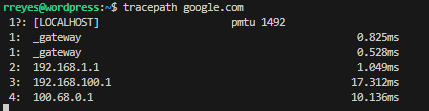
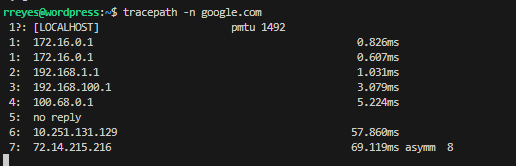
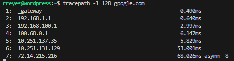

---

# Working with `tracepath` in Ubuntu

## Overview

`tracepath` is a network diagnostic tool similar to `traceroute`, used to trace the path packets take from the source to a destination. It helps identify network latency and bottlenecks along the route, but does not require root privileges, making it user-friendly.

<iframe width="720" height="425" src="https://www.youtube.com/embed/videoID1"></iframe>

<iframe width="720" height="425" src="https://www.youtube.com/embed/videoID2"></iframe>

## Common Use Cases

- Diagnosing network latency issues.
- Identifying bottlenecks along the path.
- Understanding the number of hops between a source and a destination.

## Command Options

| Command                       | Description                                              |
|-------------------------------|----------------------------------------------------------|
| `tracepath <destination>`     | Traces the path to the destination, showing each hop.    |
| `tracepath -n <destination>`  | Displays IP addresses without resolving hostnames.       |
| `tracepath -l <size> <dest>`  | Sets the packet length to test larger/smaller MTUs.      |
| `tracepath -p <port> <dest>`  | Specifies a UDP port for outgoing packets.               |

### Example Usage

Here are practical examples of how to use the `tracepath` command to monitor network paths.

1. **Basic Tracepath to a Destination**:
   ```bash
   tracepath google.com
   ```

   
   This command displays the path to `google.com`, showing each hop and its latency.

2. **Tracepath without Hostname Resolution**:
   ```bash
   tracepath -n google.com
   ```
   
   
   
   This command skips DNS lookups, which speeds up the tracing and shows only IP addresses.
   
3. **Testing Path with Specified Packet Size**:
   ```bash
   tracepath -l 128 google.com
   ```
   
   
   This sets the packet size to 128 bytes, which can help test for path MTU issues.

### Output Details

The `tracepath` output provides insight into each hop, latency, and potential network limitations. Below is a sample output and an explanation of each column:

```plaintext
1:  192.168.1.1   0.123ms
2:  10.0.0.1      1.456ms
3:  8.8.8.8       5.789ms
```

- **Hop**: The hop number, starting from the source.
- **Address**: IP address or hostname of each hop.
- **Latency**: Time (in milliseconds) to reach the hop, indicating network speed or delay.

### Advanced Filtering Example

Use multiple options to customize `tracepath` output:
```bash
tracepath -n -l 128 google.com
```

- **-n**: Skips hostname resolution.
- **-l**: Sets packet length for MTU testing.

### Example Output

```plaintext
1: 192.168.1.1    0.456ms
2: 10.0.0.1       1.678ms
3: 8.8.8.8        5.900ms
```

## Practice Exercises

1. Use `tracepath` to determine the number of hops to a destination and note the latency.
2. Trace a path using `tracepath -n` and compare the latency.
3. Test the effect of different packet sizes using `tracepath -l <size>` to understand the impact of MTU on network paths.

## Additional Resources

- [Video: Tracing Network Paths with Tracepath](https://www.example.com/tracepath-video)
- [Guide: Using Tracepath for Diagnostics](https://www.example.com/tracepath-guide)

## Relevance to Network Monitoring

Network monitoring tools can integrate `tracepath` to troubleshoot connectivity issues, making it useful for diagnosing and resolving network latency or bottlenecks in routing paths.

# References

- Learn Linux TV. (2022, September 12). *Trace network paths with tracepath for diagnostics* [Video]. YouTube. https://www.youtube.com/watch?v=videoID1
- Red Hat. (2021, May 15). *Using tracepath for network diagnostics*. https://www.redhat.com/en/blog/tracepath
## Relevance to Nagios
Nagios can automate `tracepath` checks to monitor network latency and identify any problematic network routes that may be causing delays.
